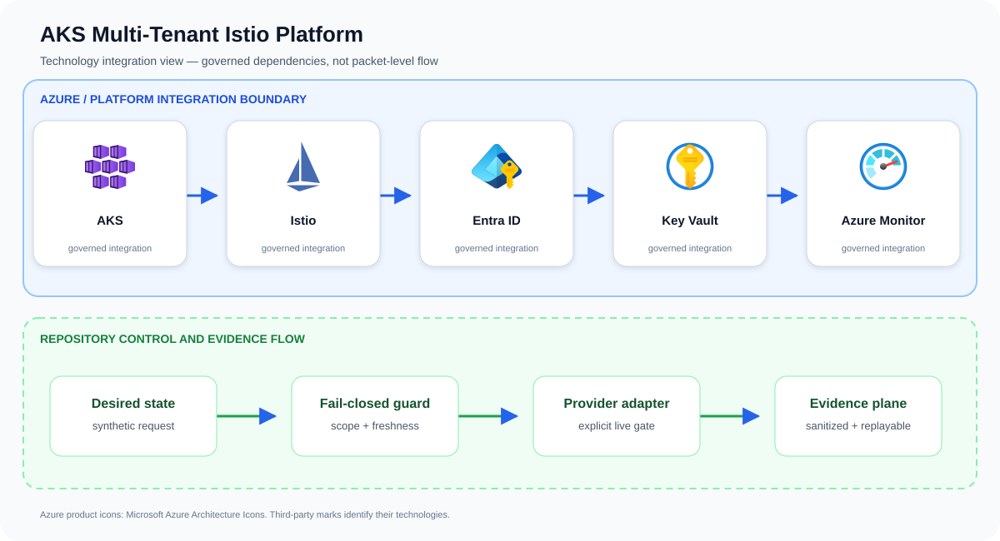

# AKS Multi-Tenant Istio Platform

A production-oriented reference implementation for hard team isolation on a
shared Azure Kubernetes Service cluster. It combines a private AKS baseline
with managed Istio and deterministic tenant bundles containing namespace,
quota, RBAC, workload identity, default-deny networking, strict mTLS,
authorization, and egress controls.

This project demonstrates technical safeguards; it does not make a compliance
or absolute-isolation claim. Kubernetes cluster administrators, Azure
subscription owners, shared nodes, DNS, and the Istio control plane remain
trust boundaries. Use dedicated clusters when those boundaries are not
acceptable.

## Problem statement

Two synthetic tenants are rendered into isolated namespaces with quotas, default-deny network policy, Istio strict mTLS, scoped authorization, and controlled egress; tests prove that cross-tenant paths remain denied.

A production implementation can still fail even when every resource deploys successfully. The material risk is a cluster that appears healthy while administration, workload identity, tenant isolation, recovery, scaling, or egress differs from the reviewed design. The design therefore treats AKS, Istio, Entra ID, and the surrounding identity and evidence controls as one reviewable system rather than unrelated configuration tasks.

## Example case study

### Situation

An internal platform team wants to consolidate small business-unit workloads onto one AKS cluster without turning namespace boundaries into an honor system. This project makes isolation explicit and testable while retaining shared operational tooling.

### Response

Two product teams deploy similarly named services into isolated namespaces. The rendered Istio and Kubernetes policies allow intended ingress and service calls, while a synthetic cross-tenant request is denied with reproducible evidence.

The team first exercises the repository's synthetic approved and denied fixtures. An approved request must produce the same idempotent plan on replay; a stale, unscoped, public, or unapproved request must fail before an Azure adapter is allowed to run.

### Expected outcome

Stakeholders receive a decision package they can attach to a change record: requested scope, controls evaluated, the reason for approval or denial, and the explicit handoff to live integration. The example supports design review and incident rehearsal without pretending that a local test changed Azure.

## Architecture



The upper boundary names the principal services and technologies used by this repository. The lower boundary shows the implemented control flow: desired state is validated, provider action remains an explicit integration gate, and sanitized evidence is retained for review and deterministic replay.

Azure product icons come from [Microsoft's official Azure Architecture Icons](https://learn.microsoft.com/azure/architecture/icons/). Open-source marks are sourced from [Simple Icons](https://simpleicons.org/) when shown; each mark identifies its respective technology.

See [architecture](docs/architecture.md), [threat model](docs/threat-model.md),
[ADR 0001](docs/adr/0001-managed-istio-and-namespace-boundary.md), and the
[operator runbook](docs/runbook.md).

## Local quickstart

Prerequisites: Python 3.11+, Azure CLI with Bicep, and optionally `kubectl`.

```bash
python3 src/tenant_renderer.py \
  --config examples/tenants/team-blue.json \
  --output build/team-blue.json
python3 -m unittest discover -s tests -v
./scripts/validate.sh
```

Inspect the bundle before applying it:

```bash
kubectl apply --dry-run=server -f build/team-blue.json
kubectl apply -f build/team-blue.json
```

The renderer refuses unsafe tenant IDs, empty owner groups, broad egress
wildcards, and non-positive quotas. Re-running it with the same input produces
the same output.

## Azure deployment

No command runs automatically and Azure deployment is chargeable.

```bash
az deployment sub what-if \
  --location westeurope \
  --template-file infra/main.bicep \
  --parameters environmentName=demo location=westeurope

az deployment sub create \
  --location westeurope \
  --template-file infra/main.bicep \
  --parameters environmentName=demo location=westeurope
```

The deployment creates a resource group, private AKS cluster, Key Vault,
Azure Monitor workspace, and Managed Grafana. Private DNS connectivity from
the operator network and suitable Azure role assignments are deployment
prerequisites. Tenant workload identity federated credentials are deliberately
left to an identity owner because client IDs and issuer trust are
organization-specific.

## Security invariants

- AKS local accounts and public API access are disabled.
- Azure RBAC, OIDC issuer, workload identity, Defender, and managed Istio are
  enabled.
- Every tenant starts with ingress and egress denied.
- DNS, same-namespace traffic, and explicit egress hosts are separate grants.
- Istio mutual TLS is `STRICT`; authorization only accepts the tenant service
  account namespace.
- Namespaced operators cannot create RBAC bindings or mutate platform policy.
- Quotas and default limits reduce noisy-neighbor impact but cannot eliminate
  shared-node contention.

## Verification and evidence

[`./scripts/validate.sh`](scripts/validate.sh) compiles Bicep when Azure CLI is available, renders the
sample twice and compares bytes, runs unit/security tests, validates JSON, and
checks shell scripts. CI repeats these gates and runs Trivy configuration and
secret scans. Live AKS denial, recovery, identity, load, and teardown tests are
documented in [the test matrix](docs/test-matrix.md) and require an isolated
Azure subscription.

## Cost and teardown

The dominant costs are AKS nodes, Managed Grafana, and log ingestion. A small
non-production cluster is expected to cost hundreds of USD per month depending
on region, node type, retention, and traffic; use Azure Pricing Calculator
before deployment. Remove tenant resources with
`kubectl delete namespace <tenant>` and the Azure baseline with
`az group delete --name <deployment-output-resource-group>`. See the runbook
for safeguards and evidence collection.

## Project status

This is a `v0.1.0` reference vertical slice. Known limitations are documented
in [the architecture](docs/architecture.md#limitations). See
[SECURITY.md](SECURITY.md), [CONTRIBUTING.md](CONTRIBUTING.md),
[SUPPORT.md](SUPPORT.md), and [CHANGELOG.md](CHANGELOG.md).

## Repository guide

- [Architecture](docs/architecture.md)
- [Threat model](docs/threat-model.md)
- [Operations runbook](docs/runbook.md)
- [Test matrix](docs/test-matrix.md)
- [Security policy](SECURITY.md)
- [Contributing guide](CONTRIBUTING.md)
- [Support policy](SUPPORT.md)
- [Changelog](CHANGELOG.md)
- [License](LICENSE)
